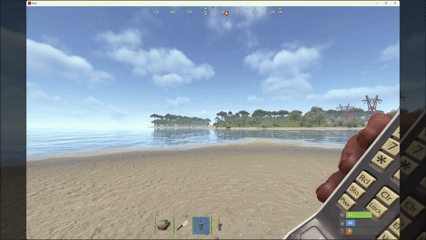
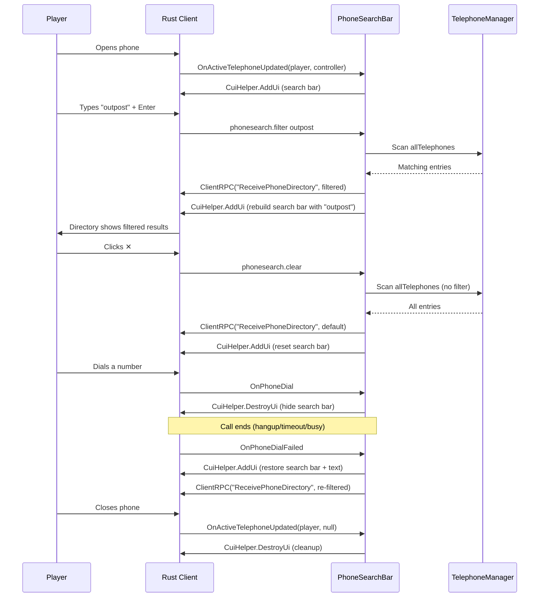

# 📞 Phone Search Bar

An [Oxide](https://umod.org/) plugin for [Rust](https://rust.facepunch.com/) that adds a search bar to the in-game phone directory, letting players filter phones by name instead of scrolling through pages. 🔍



## ✨ Features

- 🔎 **Search by name** — type a name and press Enter to filter the phone directory
- 🔤 **Case-insensitive matching** — `outpost`, `Outpost`, and `OUTPOST` all work
- ❌ **Clear button (✕)** — one click to reset the filter and restore the full directory
- 💬 **Placeholder text** — "Search..." prompt sits behind the input field
- 📱 **Call-aware** — the search bar hides during calls and restores your search when you hang up
- 🪶 **Lightweight** — no config, no data files, no permissions. Drop it in and go.

## 📦 Installation

1. Copy `src/PhoneSearchBar.cs` to your server's `oxide/plugins/` directory.
2. The plugin loads automatically — no configuration needed ✅

## 🎮 Usage

1. 📞 Pick up or interact with any phone (landline or mobile)
2. 🖥️ The search bar appears above the phone panel
3. ⌨️ Type a name and press **Enter** to filter
4. 🧹 Click **✕** to clear the filter
5. 👋 Close the phone to dismiss the search bar

## 🔨 Building

### Prerequisites

- [.NET SDK](https://dotnet.microsoft.com/download) (targeting .NET Framework 4.8)
- A local build of [Oxide.Rust](https://github.com/OxideMod/Oxide.Rust) at `../Oxide.Rust/`

The project references game and Oxide assemblies from `../Oxide.Rust/src/bin/Debug/net48/`. If your Oxide.Rust build is elsewhere, update the `OxideDir` property in `src/PhoneSearchBar.csproj`.

### Build

```sh
cd src
dotnet build
```

## ⚙️ How It Works

The plugin hooks into the phone lifecycle via Oxide hooks:

| Hook | Purpose |
|---|---|
| `OnActiveTelephoneUpdated` | Show/destroy search bar when phone opens/closes |
| `OnPhoneDial` | Hide search bar when a call starts |
| `OnPhoneDialFailed` | Restore search bar (with previous filter) when a call ends |
| `OnPlayerDisconnected` | Clean up player state |
| `Unload` | Destroy all CUIs and clear state on plugin unload |

When a player searches, the plugin filters `TelephoneManager.allTelephones` server-side and sends the results via the `ReceivePhoneDirectory` RPC — the same mechanism the vanilla game uses to populate the directory.

### Sequence Diagram



### 🛡️ Safety

- ⏱️ **250ms cooldown** per player to prevent command spam
- 📏 **30-character input limit** matching vanilla phone name length
- 🚫 **Null/destroyed object guards** for all Unity entities
- ♻️ **Pooled ProtoBuf objects** with `try/finally` disposal to prevent memory leaks
- 🧹 **Automatic cleanup** on plugin unload, player disconnect, and phone destruction

## 📚 Docs

- 💡 [`docs/IDEA.md`](docs/IDEA.md) — original project concept and resource links
- 🎯 [`docs/UX.md`](docs/UX.md) — expected player experience and behavior details
- ✅ [`docs/VALIDATION.md`](docs/VALIDATION.md) — safety checklist and edge-case documentation
- 🧪 [`docs/TESTS.md`](docs/TESTS.md) — manual behavioral test checklist

## ⚠️ Limitations

- ⏎ **Enter to search** — Rust's CUI input only fires on Enter, not per-keystroke
- 🔄 **Tab switching resets results** — switching to another phone tab and back loads the vanilla directory; your search text is preserved so you can press Enter to re-filter
- 🔢 **12 results max** — matches the vanilla directory page size; filtered results are sorted alphabetically
- 📄 **No pagination of filtered results** — vanilla page buttons won't paginate the filtered view
- 🖥️ **Position tuning** — the CUI overlay uses screen-space anchors that may need adjustment per resolution

## 📄 License

MIT

---

*Built with 🤖 [GitHub Copilot](https://github.com/features/copilot) as co-author.*
