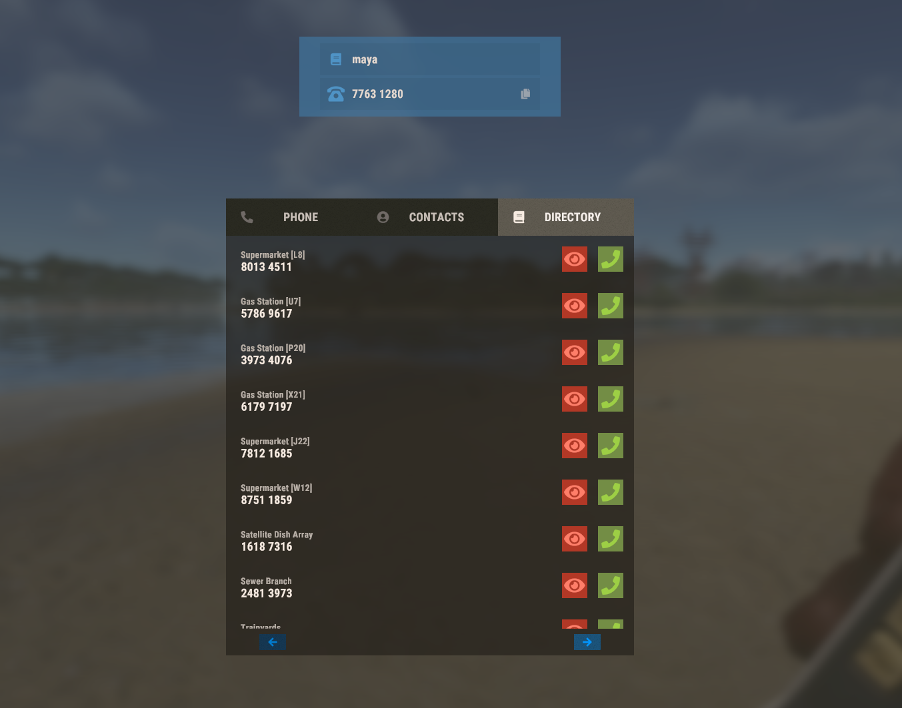

# IDEA

## Intro
This repo is an Oxide.Rust plugin for building a "Search Bar" in the "Directory" when a player uses a cell phone in the game Rust.

This search bar will filter out the list of names to only those that match the entered text.

Here is an example of the UI without the Search Bar 

## Resources

### UI
You can read about UI Components in Oxide.Rust here:

https://docs.oxidemod.com/guides/developers/basic-cui/basic-cui

I think we'll need the input text component

https://docs.oxidemod.com/guides/developers/basic-cui/basic-cui#cuiinputfieldcomponent

### Plugin Development

The Plugin Tutorial is located here:

https://docs.oxidemod.com/guides/developers/my-first-plugin

The "development environment" is described here:

https://docs.oxidemod.com/guides/developers/development-environment

Oxide.Rust project and corresponding DLLs are located at are built and located on disk at `../../Oxide.Rust/src/bin/Debug`